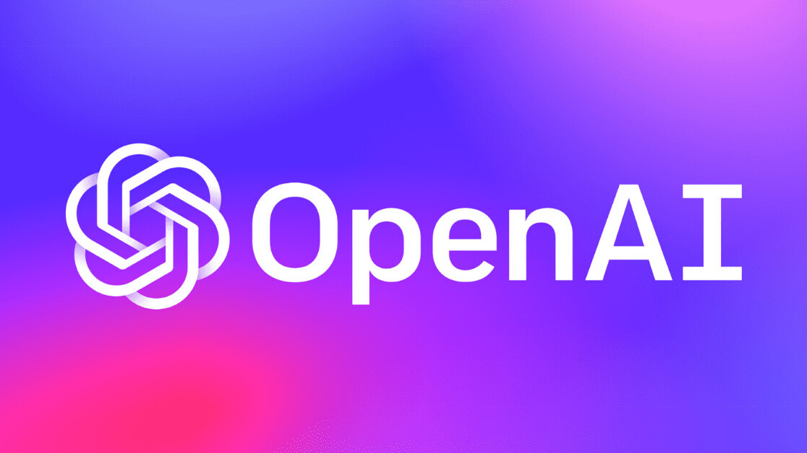

#  Culinary-Query
Automated Menu Item Question Generator
=  Culinary-Query: Automated Menu Item Question Generator: 
:toc:
:toc-placement!:


**The Culinary Query** project seamlessly integrate **OpenAI's ChatGPT** into a **Django application**, enabling **automated question generation** for **menu items** based on their descriptions and ingredients. This repository provides the necessary components and documentation to achieve this integration, including setting up **scheduled tasks**, building **API endpoints**, and **storing generated questions** in a database.

The project is currently hosted on __PythonAnyWhere__ server for testing purpose : https://culinaryquery.pythonanywhere.com/

== Website 

[discrete]
# INDEX

toc::[]

== Technologies Used

- **Django Rest Framework**: A powerful and flexible toolkit for building Web APIs using Django.
- **Python**: The programming language used for the backend development.
- **MySQL**: A robust and scalable relational database for storing blog posts, user information, and related data. (provided by __PythonAnyWhere__ server)
- **PythonAnyWhere**: The server used for testing and demonstration purposes.
- **OpenAI API**: API for accessing new AI models developed by OpenAI.


== Getting Started

1. Clone the repository:

   $ git clone https://github.com/Tiwari-Pranav/Culinary-Query

   $ cd CulinaryQuery

2. Set up your environment:

   Install the required packages listed in requirements.txt:
   $ pip install -r requirements.txt

3. Configure OpenAI API Key:

   Set your OpenAI API key in the `.env` file.

4. Run the Django application:

   $ python manage.py runserver

5. Access the API endpoints and explore the functionality.


== API Endpoints

The Django application exposes several API endpoints, catering to different use cases:

- On-Demand Question Generation: Users can request the API to generate questions for specific menu items. ChatGPT utilizes menu item descriptions to create questions, which are then stored in the database.
- Fetching Pre-Generated Questions: An API endpoint enables users to retrieve pre-generated questions from the database for a given menu item. This feature is particularly useful when questions have already been generated and stored.
- Generating Questions from Text: Users can input any text, and the API will generate a relevant question based on that text. This functionality extends the application's use beyond menu item descriptions.


|===
| Endpoint Name | Purpose | Methods Allowed

| `/api/menuitems/`
| Retrieve a list of all menu items or create a new menu item.
| GET, POST

| `/api/menuitems/{pk}/`
| Retrieve, update, or delete a specific menu item.
| GET, PUT, DELETE

| `/api/generate-questions/`
| Generate questions for specified menu items based on their descriptions.
| POST

| `/api/suggest-questions/{pk}/`
| Fetch pre-generated questions for a specific menu item.
| GET

| `/api/generate-question/`
| Generate a question based on provided text.
| POST
|===

NOTE: Replace `{pk}` with the actual primary key of the menu item.

    The format for sending data as a POST request to the `generate-questions` is as follows:
  ```json
  {
    "menu_item_ids": [1, 2, 3]
  }


== Cron Job Creation

The daily question generation process is automated using a cron job. This ensures that the question database remains updated with relevant questions for each menu item.

python manage.py generate_questions

- **Linux** (using the crontab utility):

  To schedule the `generate_questions` management command to run once daily, you can use the crontab utility.
  - Open the crontab configuration with the command: `crontab -e`
  - Add an entry to run the command daily at a specific time:
    ```
    0 2 * * * /path/to/your/python /path/to/your/manage.py generate_questions
    ```

- **Windows** (using Task Scheduler):

  To schedule the `generate_questions` management command to run once daily on Windows, you can use the Task Scheduler.
  - Open the Task Scheduler.
  - Create a new task with the following settings:
    - Program/script: Path to your Python executable (e.g., `C:\Python\python.exe`).
    - Add arguments: Path to your manage.py and the command (`manage.py generate_questions`).
    - Set the task to run daily at a specific time.

== Project Components

=== Django Framework

The project is developed using the Django web framework, a powerful tool for building web applications. The application's architecture is based on Django's Model-View-Controller (MVC) pattern, allowing for organized data modeling, logic implementation, and user interface design.

=== OpenAI's ChatGPT

The core engine behind question generation is OpenAI's ChatGPT model. This model employs natural language processing to create meaningful and contextually relevant questions based on menu item descriptions.

=== Scheduled Task: Daily Question Generation

A scheduled task, configured using cron jobs, automates the process of generating questions for menu items. This ensures that the question database remains up-to-date with relevant and current questions.

== Benefits and Outcomes

- Efficient Question Generation: Integrating ChatGPT streamlines question generation, enhancing the user experience and ensuring high-quality questions.
- Automation with Cron Jobs: Scheduled question generation keeps the database updated and relevant without manual intervention.
- Flexible API Endpoints: The APIs cater to various needs, providing dynamic content generation and retrieval.
- Database Storage: All questions are stored in the database, allowing easy management and retrieval.
- Enhanced User Engagement: On-demand question generation improves user engagement and dynamic content.

== Conclusion

The CulinaryQuery project combines the power of OpenAI's ChatGPT with Django's capabilities to create a robust system for automated question generation, storage, and retrieval. By offering versatile API endpoints, this integration provides relevant and engaging content for users, enhancing the application's utility and user experience.

__CulinaryQuery is a step toward creating an intelligent and interactive platform for exploring menu items through thoughtful questions and engaging interactions.__



image::images/django-logo.png[Django Logo, width=450]

